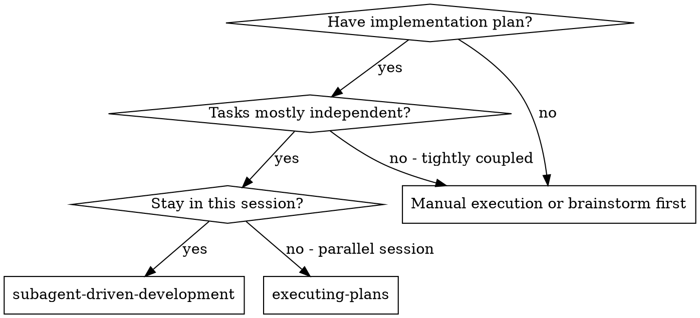
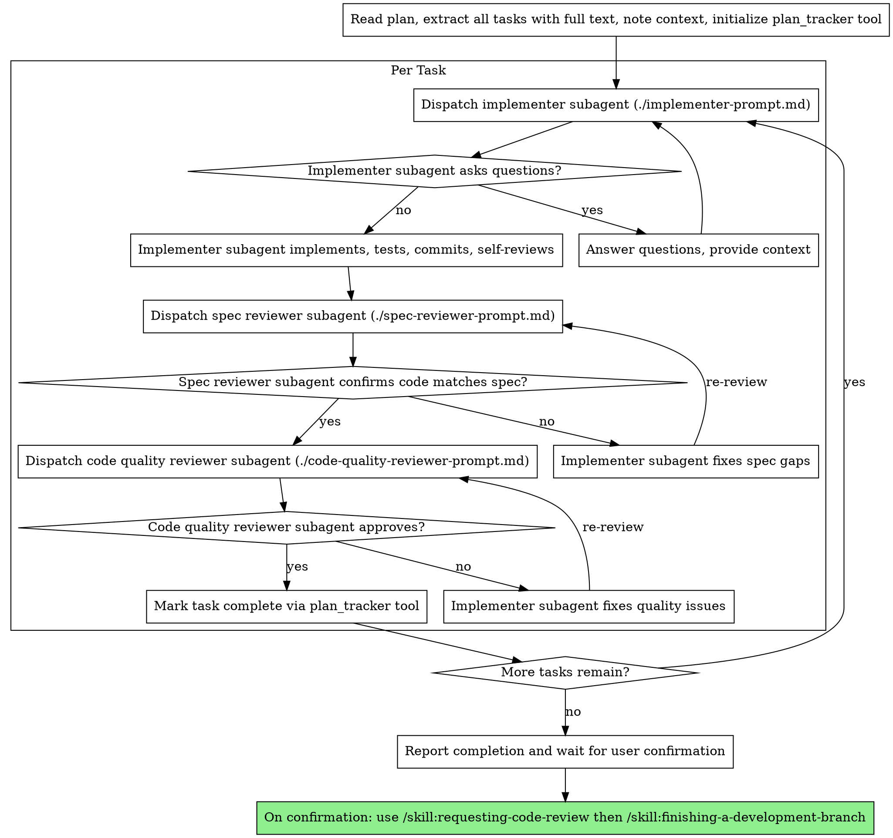

> **Related skills:** Need an isolated workspace? `/skill:using-git-worktrees`. Need a plan first? `/skill:writing-plans`. Done? `/skill:finishing-a-development-branch`.
>
> **JJ guidance:** @.pi/skills/jj-basic/SKILL.md, @.pi/skills/jj-intermediate/SKILL.md, @.pi/skills/jj-expert/SKILL.md

## Repo-Local Nix Purity Rule
- Treat every repository as a self-contained world during Nix evaluation.
- Never reference files from a parent repo, sibling checkout, ad-hoc absolute path, or undeclared local path escape inside Nix code.
- If reusable Nix code is needed, it must live inside the active repository or arrive through a declared flake input; if we create that code, it belongs in a repository and our repository workflow remains JJ-first, with Git only as backend transport.
- Deep modules must not `../`-escape repo boundaries to find package code. Root-wire shared derivations from the active repo root and pass them down through module arguments / `specialArgs`.


# Subagent-Driven Development

Execute plan by dispatching fresh subagent per task, with two-stage review after each: spec compliance review first, then code quality review.

**Core principle:** Fresh subagent per task + two-stage review (spec then quality) = high quality, fast iteration

If a tool result contains a ⚠️ workflow warning, stop immediately and address it before continuing.

## Prerequisites
- Establish JJ state via @.pi/skills/jj-intermediate/SKILL.md and the `jj-agent` lane before implementation/review/finalization.
- For nested component repos or ambiguous JJ state, escalate via @.pi/skills/jj-expert/SKILL.md rather than substituting Git state.
- Approved plan or clear task scope

## When to Use


```dot
digraph when_to_use {
    "Have implementation plan?" [shape=diamond];
    "Tasks mostly independent?" [shape=diamond];
    "Stay in this session?" [shape=diamond];
    "subagent-driven-development" [shape=box];
    "executing-plans" [shape=box];
    "Manual execution or brainstorm first" [shape=box];

    "Have implementation plan?" -> "Tasks mostly independent?" [label="yes"];
    "Have implementation plan?" -> "Manual execution or brainstorm first" [label="no"];
    "Tasks mostly independent?" -> "Stay in this session?" [label="yes"];
    "Tasks mostly independent?" -> "Manual execution or brainstorm first" [label="no - tightly coupled"];
    "Stay in this session?" -> "subagent-driven-development" [label="yes"];
    "Stay in this session?" -> "executing-plans" [label="no - parallel session"];
}
```

**vs. Executing Plans (parallel session):**
- Same session (no context switch)
- Fresh subagent per task (no context pollution)
- Two-stage review after each task: spec compliance first, then code quality
- Faster iteration (no human-in-loop between tasks)

**Dependent tasks:** Most real plans have some dependencies. For dependent tasks, include the previous task's implementation summary and relevant file paths in the next subagent's context. Track what each completed task produced so you can pass it forward.

## The Process


```dot
digraph process {
    rankdir=TB;

    subgraph cluster_per_task {
        label="Per Task";
        "Dispatch implementer subagent (./implementer-prompt.md)" [shape=box];
        "Implementer subagent asks questions?" [shape=diamond];
        "Answer questions, provide context" [shape=box];
        "Implementer subagent implements, tests, commits, self-reviews" [shape=box];
        "Dispatch spec reviewer subagent (./spec-reviewer-prompt.md)" [shape=box];
        "Spec reviewer subagent confirms code matches spec?" [shape=diamond];
        "Implementer subagent fixes spec gaps" [shape=box];
        "Dispatch code quality reviewer subagent (./code-quality-reviewer-prompt.md)" [shape=box];
        "Code quality reviewer subagent approves?" [shape=diamond];
        "Implementer subagent fixes quality issues" [shape=box];
        "Mark task complete via plan_tracker tool" [shape=box];
    }

    "Read plan, extract all tasks with full text, note context, initialize plan_tracker tool" [shape=box];
    "More tasks remain?" [shape=diamond];
    "Report completion and wait for user confirmation" [shape=box];
    "On confirmation: use /skill:requesting-code-review then /skill:finishing-a-development-branch" [shape=box style=filled fillcolor=lightgreen];

    "Read plan, extract all tasks with full text, note context, initialize plan_tracker tool" -> "Dispatch implementer subagent (./implementer-prompt.md)";
    "Dispatch implementer subagent (./implementer-prompt.md)" -> "Implementer subagent asks questions?";
    "Implementer subagent asks questions?" -> "Answer questions, provide context" [label="yes"];
    "Answer questions, provide context" -> "Dispatch implementer subagent (./implementer-prompt.md)";
    "Implementer subagent asks questions?" -> "Implementer subagent implements, tests, commits, self-reviews" [label="no"];
    "Implementer subagent implements, tests, commits, self-reviews" -> "Dispatch spec reviewer subagent (./spec-reviewer-prompt.md)";
    "Dispatch spec reviewer subagent (./spec-reviewer-prompt.md)" -> "Spec reviewer subagent confirms code matches spec?";
    "Spec reviewer subagent confirms code matches spec?" -> "Implementer subagent fixes spec gaps" [label="no"];
    "Implementer subagent fixes spec gaps" -> "Dispatch spec reviewer subagent (./spec-reviewer-prompt.md)" [label="re-review"];
    "Spec reviewer subagent confirms code matches spec?" -> "Dispatch code quality reviewer subagent (./code-quality-reviewer-prompt.md)" [label="yes"];
    "Dispatch code quality reviewer subagent (./code-quality-reviewer-prompt.md)" -> "Code quality reviewer subagent approves?";
    "Code quality reviewer subagent approves?" -> "Implementer subagent fixes quality issues" [label="no"];
    "Implementer subagent fixes quality issues" -> "Dispatch code quality reviewer subagent (./code-quality-reviewer-prompt.md)" [label="re-review"];
    "Code quality reviewer subagent approves?" -> "Mark task complete via plan_tracker tool" [label="yes"];
    "Mark task complete via plan_tracker tool" -> "More tasks remain?";
    "More tasks remain?" -> "Dispatch implementer subagent (./implementer-prompt.md)" [label="yes"];
    "More tasks remain?" -> "Report completion and wait for user confirmation" [label="no"];
    "Report completion and wait for user confirmation" -> "On confirmation: use /skill:requesting-code-review then /skill:finishing-a-development-branch";
}
```

## Prompt Templates

- `./implementer-prompt.md` - Dispatch implementer subagent
- `./spec-reviewer-prompt.md` - Dispatch spec compliance reviewer subagent
- `./code-quality-reviewer-prompt.md` - Dispatch code quality reviewer subagent

**How to dispatch:**

Use the `subagent` tool directly with the template text filled in:

```ts
subagent({ agent: "implementer", task: "... full implementer prompt text ..." })
```

```ts
subagent({ agent: "spec-reviewer", task: "... full review prompt text ..." })
```

```ts
subagent({ agent: "code-reviewer", task: "... full review prompt text ..." })
```

## Example Workflow

```
You: I'm using Subagent-Driven Development to execute this plan.

[Read plan file once: docs/plans/feature-plan.md]
[Extract all 5 tasks with full text and context]
[Initialize plan_tracker tool with all tasks]

Task 1: Hook installation script

[Get Task 1 text and context (already extracted)]
[Dispatch implementation subagent with full task text + context]

Implementer: "Before I begin - should the hook be installed at user or system level?"

You: "User level (~/.config/superpowers/hooks/)"

Implementer: "Got it. Implementing now..."
[Later] Implementer:
  - Implemented install-hook command
  - Added tests, 5/5 passing
  - Self-review: Found I missed --force flag, added it
  - Committed

[Dispatch spec compliance reviewer]
Spec reviewer: ✅ Spec compliant - all requirements met, nothing extra

[Ask `jj-agent` for the bounded review range, then dispatch code quality reviewer. Use `jj-expert` only as fallback/rescue if the `jj-agent` lane misbehaves.]
Code reviewer: Strengths: Good test coverage, clean. Issues: None. Approved.

[Mark Task 1 complete]

Task 2: Recovery modes

[Get Task 2 text and context (already extracted)]
[Dispatch implementation subagent with full task text + context]

Implementer: [No questions, proceeds]
Implementer:
  - Added verify/repair modes
  - 8/8 tests passing
  - Self-review: All good
  - Committed

[Dispatch spec compliance reviewer]
Spec reviewer: ❌ Issues:
  - Missing: Progress reporting (spec says "report every 100 items")
  - Extra: Added --json flag (not requested)

[Implementer fixes issues]
Implementer: Removed --json flag, added progress reporting

[Spec reviewer reviews again]
Spec reviewer: ✅ Spec compliant now

[Ask `jj-agent` for the bounded review range, then dispatch code quality reviewer. Use `jj-expert` only as fallback/rescue if the `jj-agent` lane misbehaves.]
Code reviewer: Strengths: Solid. Issues (Important): Magic number (100)

[Implementer fixes]
Implementer: Extracted PROGRESS_INTERVAL constant

[Code reviewer reviews again]
Code reviewer: ✅ Approved

[Mark Task 2 complete]

...

[After all tasks]
[Report completion to user and wait for confirmation]
[On confirmation, dispatch requesting-code-review + finishing-a-development-branch flows]

Done!
```

## Red Flags

**Never:**
- Start implementation on main/master branch without explicit user consent
- Skip reviews (spec compliance OR code quality)
- Proceed with unfixed issues
- Dispatch multiple implementation subagents in parallel (conflicts)
- Make subagent read plan file (provide full text instead)
- Skip scene-setting context (subagent needs to understand where task fits)
- Ignore subagent questions (answer before letting them proceed)
- Accept "close enough" on spec compliance (spec reviewer found issues = not done)
- Skip review loops (reviewer found issues = implementer fixes = review again)
- Let implementer self-review replace actual review (both are needed)
- **Start code quality review before spec compliance is ✅** (wrong order)
- Move to next task while either review has open issues

**If subagent asks questions:**
- Answer clearly and completely
- Provide additional context if needed
- Don't rush them into implementation

**If reviewer finds issues:**
- Implementer (same subagent) fixes them
- Reviewer reviews again
- Repeat until approved
- Don't skip the re-review

**If subagent fails task:**
- See **"When a Subagent Fails"** below — never code directly, always re-dispatch or escalate

## Subagent Reliability & Raw Evidence Contract

- **Reliability:** If the primary JJ execution lane is unavailable or clearly misbehaving, stop chain execution, report blocked state, and retry once with `jj-expert` as explicit fallback/rescue.
- **JJ routing:** Use @.pi/skills/jj-intermediate/SKILL.md for routine bounded JJ evidence requirements and @.pi/skills/jj-expert/SKILL.md for contradictory or recovery-heavy JJ state.
- **Non-Empty Output Mitigation:** Add this at top of subagent tasks: `First line MUST be: Status: success|blocked|no-op`.
- **Structured Handoff Contract:** Every dispatched task must include: `Goal`, `Scope`, `Out-of-Scope`, `Output Contract`, `Verification Commands`.
- **CozoScript-First Handoff (MVP):** For common logical-constraint handoffs, include a compact CozoScript dialect block (from `mentci-cozo`) representing constraints and verification intent.
- **Bounded Retry Rule:** One retry maximum for the same failed task; retry prompt must simplify scope and restate output contract.
- **Raw Evidence Packet:**
    - For all completion claims, provide a `## Raw Evidence Packet` section.
    - Include the verification command output (tests/build/etc) plus the JJ evidence required by the relevant JJ skill.

## Mandatory Phase Loop
Before advancing, ensure this loop is closed for every task:
1. Brainstorm
2. Plan
3. Implement
4. Test
5. Review
6. Re-implement with Review

**Stop Conditions:**
- Never advance with missing evidence.
- Never advance with unresolved review issues.
- If loop is broken, revert to previous state and re-initialize.

## After All Tasks Complete

When all tasks are done and reviewed, **stop and report to the user**:

1. Summarize what was implemented (tasks completed, files changed, test counts)
2. Ask: "All tasks complete. Ready for final review and finishing?"
3. **Wait for user confirmation before proceeding**

Do NOT automatically dispatch final review or start the finishing skill. The user may want to test manually, adjust scope, or take a break before the final phase.

## CozoScript Dialect for Agent Handoffs (MVP)
Use this for the most common case: expressing logical constraints on task execution.

```cozoscript
?[field, op, value] :=
    *handoff_constraint{task_id: "<task-id>", field, op, value}
:order field
```

Recommended operators in MVP: `eq`, `neq`, `contains`, `not_contains`, `exists`.

## LSP in the Task Loop (Skilled Usage)
- During each task, use `lsp symbols`/`definition` before broad grep to tighten scope.
- Run `lsp diagnostics` on edited files before handing to reviewer agents.
- For cross-file changes, run bounded `lsp workspace-diagnostics` only on touched file list.
- If LSP lane lacks file-type support, document limitation and use deterministic fallback (`read` + targeted tests).

## Integration

**Required workflow skills:**
- **`/skill:using-git-worktrees`** - For isolation workflows. Prefer independent `jj` clones for larger/multi-session efforts; worktrees are acceptable for smaller scoped changes with human approval.
- **`/skill:writing-plans`** - Creates the plan this skill executes
- **`/skill:requesting-code-review`** - Code review template for reviewer subagents
- **`/skill:finishing-a-development-branch`** - Complete development after all tasks

**Subagents follow by default:**
- **TDD** - Runtime warnings on source-before-test patterns. Implementer subagents receive three-scenario TDD instructions via agent profile and prompt template: new feature (full TDD), modifying tested code (run existing tests), trivial change (judgment call).

**Alternative workflow:**
- **`/skill:executing-plans`** - Use for parallel session instead of same-session execution

## History & Completion Guardrails
Use @.pi/skills/jj-intermediate/SKILL.md for bounded preflight, bookmark safety, empty-working-node hygiene, and routine completion checks. Use @.pi/skills/jj-expert/SKILL.md when duplicate change IDs, side bookmarks, or cleanup classification enter the workflow.

After every task that concludes a logical change, run `execute session-guard` and `execute root-guard` to validate the session narrative and the root-level filesystem invariants before handing off or proceeding to finishing. Confirm a research artifact exists or has been updated under `Research/<priority>/<Subject>/` for the current prompt to satisfy the research coverage mandate. Include these guardrail checks in the completion notes so reviewers can verify them.
