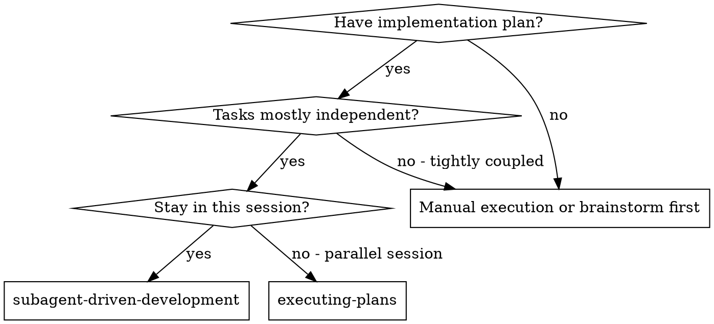
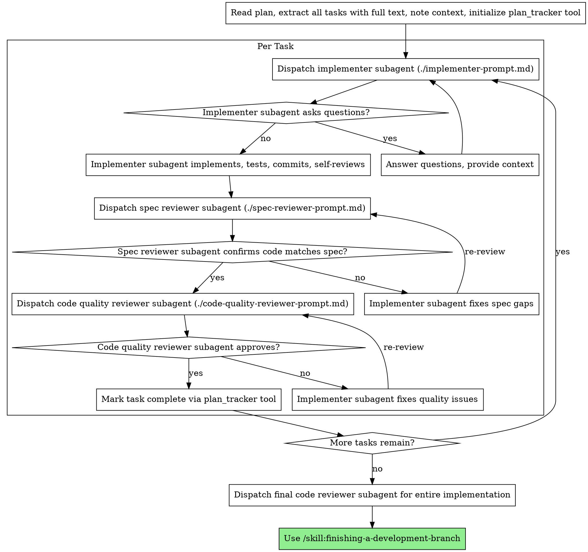

> **Related skills:** Need an isolated workspace? `/skill:using-git-worktrees`. Need a plan first? `/skill:writing-plans`. Done? `/skill:finishing-a-development-branch`.

# Subagent-Driven Development

Execute plan by dispatching fresh subagent per task, with two-stage review after each: spec compliance review first, then code quality review.

**Core principle:** Fresh subagent per task + two-stage review (spec then quality) = high quality, fast iteration

If a tool result contains a ⚠️ workflow warning, stop immediately and address it before continuing.

## Prerequisites
- Active branch (not main) or user-confirmed intent to work on main
- Approved plan or clear task scope

## When to Use



**vs. Executing Plans (parallel session):**
- Same session (no context switch)
- Fresh subagent per task (no context pollution)
- Two-stage review after each task: spec compliance first, then code quality
- Faster iteration (no human-in-loop between tasks)

**Dependent tasks:** Most real plans have some dependencies. For dependent tasks, include the previous task's implementation summary and relevant file paths in the next subagent's context. Track what each completed task produced so you can pass it forward.

## The Process



## Prompt Templates

- `./implementer-prompt.md` - Dispatch implementer subagent
- `./spec-reviewer-prompt.md` - Dispatch spec compliance reviewer subagent
- `./code-quality-reviewer-prompt.md` - Dispatch code quality reviewer subagent

**How to dispatch:**

Use the `subagent` tool directly with the template text filled in:

```ts
subagent({ agent: "implementer", task: "... full implementer prompt text ..." })
```

```ts
subagent({ agent: "spec-reviewer", task: "... full review prompt text ..." })
```

```ts
subagent({ agent: "code-reviewer", task: "... full review prompt text ..." })
```

## Example Workflow

```
You: I'm using Subagent-Driven Development to execute this plan.

[Read plan file once: docs/plans/feature-plan.md]
[Extract all 5 tasks with full text and context]
[Initialize plan_tracker tool with all tasks]

Task 1: Hook installation script

[Get Task 1 text and context (already extracted)]
[Dispatch implementation subagent with full task text + context]

Implementer: "Before I begin - should the hook be installed at user or system level?"

You: "User level (~/.config/superpowers/hooks/)"

Implementer: "Got it. Implementing now..."
[Later] Implementer:
  - Implemented install-hook command
  - Added tests, 5/5 passing
  - Self-review: Found I missed --force flag, added it
  - Committed

[Dispatch spec compliance reviewer]
Spec reviewer: ✅ Spec compliant - all requirements met, nothing extra

[Get git SHAs, dispatch code quality reviewer]
Code reviewer: Strengths: Good test coverage, clean. Issues: None. Approved.

[Mark Task 1 complete]

Task 2: Recovery modes

[Get Task 2 text and context (already extracted)]
[Dispatch implementation subagent with full task text + context]

Implementer: [No questions, proceeds]
Implementer:
  - Added verify/repair modes
  - 8/8 tests passing
  - Self-review: All good
  - Committed

[Dispatch spec compliance reviewer]
Spec reviewer: ❌ Issues:
  - Missing: Progress reporting (spec says "report every 100 items")
  - Extra: Added --json flag (not requested)

[Implementer fixes issues]
Implementer: Removed --json flag, added progress reporting

[Spec reviewer reviews again]
Spec reviewer: ✅ Spec compliant now

[Dispatch code quality reviewer]
Code reviewer: Strengths: Solid. Issues (Important): Magic number (100)

[Implementer fixes]
Implementer: Extracted PROGRESS_INTERVAL constant

[Code reviewer reviews again]
Code reviewer: ✅ Approved

[Mark Task 2 complete]

...

[After all tasks]
[Dispatch final code-reviewer]
Final reviewer: All requirements met, ready to merge

Done!
```

## Red Flags

**Never:**
- Start implementation on main/master branch without explicit user consent
- Skip reviews (spec compliance OR code quality)
- Proceed with unfixed issues
- Dispatch multiple implementation subagents in parallel (conflicts)
- Make subagent read plan file (provide full text instead)
- Skip scene-setting context (subagent needs to understand where task fits)
- Ignore subagent questions (answer before letting them proceed)
- Accept "close enough" on spec compliance (spec reviewer found issues = not done)
- Skip review loops (reviewer found issues = implementer fixes = review again)
- Let implementer self-review replace actual review (both are needed)
- **Start code quality review before spec compliance is ✅** (wrong order)
- Move to next task while either review has open issues

**If subagent asks questions:**
- Answer clearly and completely
- Provide additional context if needed
- Don't rush them into implementation

**If reviewer finds issues:**
- Implementer (same subagent) fixes them
- Reviewer reviews again
- Repeat until approved
- Don't skip the re-review

**If subagent fails task:**
- See **"When a Subagent Fails"** below — never code directly, always re-dispatch or escalate

## When a Subagent Fails

**You are the orchestrator. You do NOT write code. You dispatch subagents that write code.**

If an implementer subagent fails, errors out, or produces incomplete work:

1. **Attempt 1:** Dispatch a NEW fix subagent with specific instructions about what went wrong and what needs to change. Include the error output and the original task text.
2. **Attempt 2:** If the fix subagent also fails, dispatch one more with a different approach or simplified scope.
3. **After 2 failed attempts: STOP.** Report the failure to the user and ask how to proceed. The task likely needs redesign.

**NEVER:**
- Write code yourself to "help" or "finish up" — you are the orchestrator, not an implementer
- Try to fix the subagent's work inline — this pollutes your context and defeats the fresh-subagent model
- Silently skip the failed task and move on
- Reduce quality gates (skip reviews) because a task is "almost done"

## After All Tasks Complete

When all tasks are done and reviewed, **stop and report to the user**:

1. Summarize what was implemented (tasks completed, files changed, test counts)
2. Ask: "All tasks complete. Ready for final review and finishing?"
3. **Wait for user confirmation before proceeding**

Do NOT automatically dispatch final review or start the finishing skill. The user may want to test manually, adjust scope, or take a break before the final phase.

## Integration

**Required workflow skills:**
- **`/skill:using-git-worktrees`** - Recommended: Set up isolated workspace before starting. For small changes, branching in the current directory is acceptable with human approval.
- **`/skill:writing-plans`** - Creates the plan this skill executes
- **`/skill:requesting-code-review`** - Code review template for reviewer subagents
- **`/skill:finishing-a-development-branch`** - Complete development after all tasks

**Subagents follow by default:**
- **TDD** - Runtime warnings on source-before-test patterns. Implementer subagents receive three-scenario TDD instructions via agent profile and prompt template: new feature (full TDD), modifying tested code (run existing tests), trivial change (judgment call).

**Alternative workflow:**
- **`/skill:executing-plans`** - Use for parallel session instead of same-session execution
