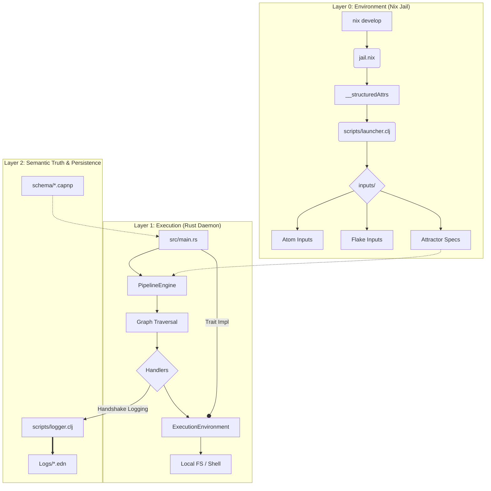

# Mentci-AI: System Architecture

The following flowchart describes the structural and operational layers of Mentci-AI, integrating the Nix Jail, Rust Daemon, and Semantic Logging protocols.

## Architectural Components

### 1. Nix Jail (Isolation)
The project operates within a **Pure Nix Jail**. `jail.nix` uses structured attributes to pass data to `scripts/launcher.clj`, which organizes all inputs into a standardized filesystem ontology under `inputs/`.

### 2. Mentci Daemon (Rust)
A **Level 5 Pipeline Engine** built in Rust. It implements the **Attractor** specification:
*   **ExecutionEnvironment**: Decouples daemon logic from the jail's shell.
*   **PipelineEngine**: Manages graph traversal and node state.
*   **Handlers**: Atomic units of work (Start, Exit, Codergen).

### 3. Semantic Layer
*   **Cap'n Proto (`schema/`)**: Defines the "Truth" of the system (Filesystem Atoms, RPCs, Graph structures).
*   **EDN Logging (`Logs/`)**: Durable, symbolic record of agent intent and model metadata, following the Handshake Logging Protocol (implemented in Babashka).

---
*The Great Work continues.*
