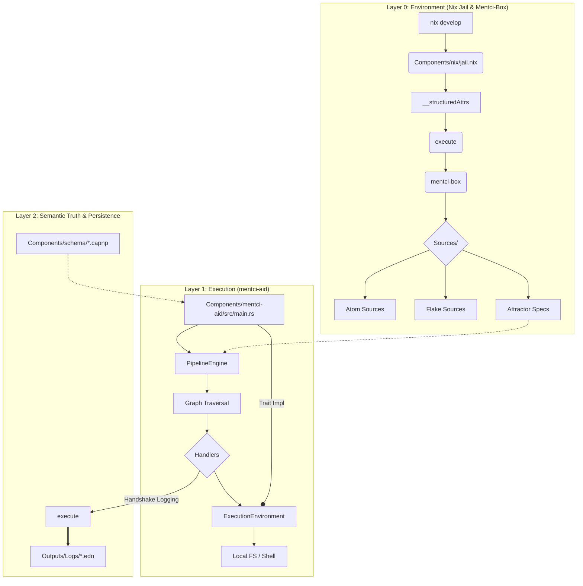

# Mentci-AI: System Architecture

The following flowchart describes the structural and operational layers of Mentci-AI, integrating the Nix Jail, Rust Daemon, and Semantic Logging protocols.

## Architectural Components

### 1. Nix Jail (Isolation)
The project operates within a **Pure Nix Jail**. `Components/nix/jail.nix` uses structured attributes to pass data to `execute`, which organizes all Sources into a standardized filesystem ontology under `Sources/`.

### 2. mentci-aid (Rust Daemon)
A **Level 5 Pipeline Engine** and autonomous "Aid" built in Rust. It implements the **Attractor** specification:
*   **ExecutionEnvironment**: Decouples daemon logic from the jail's shell.
*   **PipelineEngine**: Manages graph traversal and node state.
*   **Handlers**: Atomic units of work (Start, Exit, Codergen, WaitHuman, Agent).

**Current Operational Status:** Development phase. **Not in a running state.**

### 3. Semantic Layer
*   **Cap'n Proto (`Components/schema/`)**: Defines the "Truth" of the system (Filesystem Atoms, RPCs, Graph structures).
*   **EDN Logging (`Outputs/Logs/`)**: Durable, symbolic record of agent intent and model metadata, following the Handshake Logging Protocol (implemented in Babashka).

## 4. Recursive Process Model (Russian Doll)

The system follows a fractal, "Russian-doll" architecture for process supervision.

### 4.1. The Master Process
The top-level **"mentci-ai process"** is a self-hosted supervisor.
*   **Setup:** It configures its own environment exactly like a jailed process (mounting `Sources/`, sourcing `setup` scripts), ensuring consistency.
*   **Privilege:** Unlike jailed sub-processes, the Master Process operates in **Admin Developer Mode** (see `ARCHITECTURAL_GUIDELINES.md`), with unrestricted network and system access.
*   **Role:** It orchestrates high-level goals and supervises the execution of sub-flows.

### 4.2. Sub-Flows and Jails
Work is delegated to **Sub-Flows**, which are distinct child processes.
*   **Recursion:** A sub-flow can spawn its own nested sub-flows, creating a deep supervision tree.
*   **Isolation:** Sub-flows typically run within strict **Nix Jails** to enforce reproducibility and safety, unless granted specific escalation privileges by the supervisor.
*   **State Separation:** Each sub-flow operates on its own **unique, internal Jujutsu bookmark**. It does not pollute the global `dev` bookmark until its work is finalized and merged by the supervisor.

---
*The Great Work continues.*
