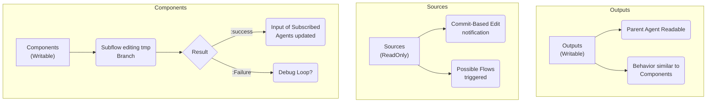

# Mentci-AI Filesystem Specification (Aski-FS)

**Status:** Operational / Canonical
**Objective:** Define the semantic lifecycle of artifacts across the Mentci-AI hierarchy.

## 1. Global Ontology



## 2. Directory Semantics

### 2.0 Canonical Typed Root Set
- Canonical top-level type root is modeled as:
  - `(enum [Sources Components Outputs Research Development Core Library])`
- In Aski-FS sugared syntax, this is written directly as:
  - `[Sources Components Outputs Research Development Core Library]`
- Interpretation rule:
  - In schema/type position, `[]` denotes enum set membership.
  - Each first-letter-capitalized root name denotes a typed filesystem domain.

### 2.0.1 Root File Allowlist
- Top-level files are restricted to design-required build/runtime entry files:
  - `flake.nix`, `flake.lock`, `Components/nix/jail.nix`, `.gitignore`, `.envrc`, `AGENTS.md`, `README.md`.
- Runtime metadata files may exist temporarily by protocol:
  - `.attrs.json`, `.opencode.edn`.
- Enforcement tool:
  - `bb Components/scripts/root_guard/main.clj`.

### 2.1 Sources (`Sources/`)
- **Mode:** Read-Only (Mount points to Nix Store or immutable snapshots).
- **Behavior:** Acts as the "Sensory Input" for the agent.
- **Ontology:** The Sources represent a hierarchical mapping of the project's semantic dependencies (Atom, Flake, and Untyped sources).
- **Propagation:** Changes in Sources (via `jj git fetch` or snapshot updates) trigger **Commit-Based Edit Notifications**, which can initiate new agentic flows.
- **Compatibility:** `Sources/` remains a transitional alias while migration is in progress.

### 2.2 Outputs (`Outputs/`)
- **Mode:** Writable (Scoped to the current session).
- **Behavior:** Intended for consumption by the Parent Agent or external supervisors.
- **Lifecycle:** Once validated, outputs are often promoted to the `Sources/` of another agent or merged into the primary repository.

### 2.3 Components (`Components/mentci-aid/`, `Components/chronos/`, `Components/scripts/`, `Components/tasks/`)
- **Mode:** Writable (via Subflows).
- **Behavior:** Subflows edit a **Temporary Branch** (anonymous `jj` revision).
- **Promotion:**
    - **:success** -> The change is committed and becomes the new input for subscribed agents.
    - **:failure** -> Initiates a **Debug Loop** (Ref: `Development/high/Debugging/`).

## 3. Symbolic Mapping (Aski-FS Structure-Driven)
The following EDN structure represents the authoritative symbolic map of the `Sources` directory, utilizing the **Structure-Driven** syntax with **Symbol Keys**.

```edn
([:v1]
 {Sources
  {:_meta {:role :tooling :durability :mutable}
   mentci-ai [:atom]
   criomos    [:flake]
   lojix      [:flake]
   seahawk    [:flake]
   skrips     [:flake]
   mkZolaWebsite [:flake]
   webpublish [:flake]
   goldragon  [:flake]
   maisiliym  [:flake]
   kibord     [:flake]
   aski       [:flake]
   attractor  [:untyped]
   attractor-docs [:untyped]
   opencode   [:untyped]}})
```

**Expansion Logic:**
- **Top-Level Tuple `(Metadata RootMap)`**:
    - `Metadata`: A Vector `[Version ...]`.
    - `RootMap`: A Map of root-level nodes using **Symbols** as keys (e.g., `Sources` not `:Sources`).
- **Directory (Map `{}`)**:
    - A value that is a Map is inferred as a Directory.
    - Reserved key `:_meta` contains directory attributes.
    - All other keys are children (Symbols or Strings).
- **File (Vector `[]`)**:
    - A value that is a Vector is inferred as a File (or Leaf Node).
    - Positional arguments define the type and attributes (e.g., `[:type :role]`).

## 4. Implementation Rules
- Agents **must** respect the `RO` (Read-Only) status of `Sources/` (or transitional `Sources/` alias during migration).
- Every writable operation **must** result in an atomic `jj` commit.
- Filesystem boundaries (directories) represent **Ontological Shifts** in data durability.

*The Great Work continues.*
