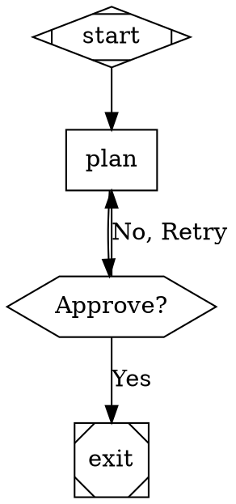

# Attractor DOT Data Reference

Extracted from `Inputs/attractor/attractor-spec.md` for incorporation. For the live implementation,
use `Inputs/brynary-attractor/attractor`.

## Overview
Attractor uses **Graphviz DOT** syntax to define agentic workflows.
- **Nodes**: Tasks (LLM calls, human gates, tool executions).
- **Edges**: Transitions (routing logic).
- **Attributes**: Configuration (prompts, models, conditions).

## DOT DSL Subset
*   **Directed Graphs Only**: `digraph Name { ... }`
*   **One Graph Per File**.
*   **Attributes**: Key-value pairs in `[...]`.
    *   Strings: `"quoted"`
    *   Numbers: `42`, `0.5`
    *   Booleans: `true`, `false`
    *   Durations: `10s`, `500ms`

## Node Types (by Shape)
The `shape` attribute determines the handler type:

| Shape           | Handler Type       | Description |
|-----------------|--------------------|-------------|
| `Mdiamond`      | `start`            | Entry point. (Required) |
| `Msquare`       | `exit`             | Exit point. (Required) |
| `box`           | `codergen`         | LLM Task (Default). |
| `hexagon`       | `wait.human`       | Human approval gate. |
| `diamond`       | `conditional`      | Routing logic (no-op handler). |
| `parallelogram` | `tool`             | External tool execution (shell). |
| `component`     | `parallel`         | Parallel fan-out. |
| `tripleoctagon` | `parallel.fan_in`  | Parallel fan-in. |

## Key Attributes

### Node
*   `prompt`: Instruction for the LLM (supports `$goal` expansion).
*   `goal_gate`: `true` if this node MUST succeed before exit.
*   `max_retries`: Retry count (default 0).
*   `fidelity`: Context window mode (`full`, `compact`, `truncate`).
*   `llm_model`: Override model (e.g., `gpt-5.2`).

### Edge
*   `condition`: Logic expression (e.g., `outcome=success`).
*   `label`: Display name and routing key.
*   `weight`: Priority for edge selection.

## Edge Selection Logic
1.  **Condition Match**: `condition` evaluates to true.
2.  **Preferred Label**: Matches `outcome.preferred_label`.
3.  **Suggested ID**: Matches `outcome.suggested_next_ids`.
4.  **Weight**: Highest `weight`.
5.  **Lexical**: Node ID sort order.

## Example

