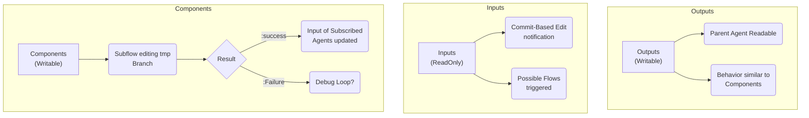

# Mentci-AI Filesystem Specification (Aski-FS)

**Status:** Operational / Canonical
**Objective:** Define the semantic lifecycle of artifacts across the Mentci-AI hierarchy.

## 1. Global Ontology



## 2. Directory Semantics

### 2.1 Inputs (`Inputs/`)
- **Mode:** Read-Only (Mount points to Nix Store or immutable snapshots).
- **Behavior:** Acts as the "Sensory Input" for the agent.
- **Ontology:** The inputs represent a hierarchical mapping of the project's semantic dependencies (Atom, Flake, and Untyped sources).
- **Propagation:** Changes in inputs (via `jj git fetch` or snapshot updates) trigger **Commit-Based Edit Notifications**, which can initiate new agentic flows.

### 2.2 Outputs (`Outputs/`)
- **Mode:** Writable (Scoped to the current session).
- **Behavior:** Intended for consumption by the Parent Agent or external supervisors.
- **Lifecycle:** Once validated, outputs are often promoted to the `Inputs/` of another agent or merged into the primary repository.

### 2.3 Components (`core/`, `src/`, `scripts/`)
- **Mode:** Writable (via Subflows).
- **Behavior:** Subflows edit a **Temporary Branch** (anonymous `jj` revision).
- **Promotion:**
    - **:success** -> The change is committed and becomes the new input for subscribed agents.
    - **:failure** -> Initiates a **Debug Loop** (Ref: `strategies/debugging/`).

## 3. Symbolic Mapping (Aski-FS Super-Sugar)
The following EDN structure represents the authoritative symbolic map of the `Inputs` directory, utilizing the **Implicit Type** syntax.

```edn
(Inputs {:role :tooling :durability :mutable}
 {:mentci-ai :atom
  :criomos :flake
  :lojix :flake
  :seahawk :flake
  :skrips :flake
  :mkZolaWebsite :flake
  :webpublish :flake
  :goldragon :flake
  :maisiliym :flake
  :kibord :flake
  :aski :flake
  :attractor :untyped
  :attractor-docs :untyped
  :opencode :untyped})
```

**Expansion Logic:**
- **Implicit Directory `(Name Attrs Children)`**: If the last argument is a map of children, the node is inferred as `:kind :dir`.
- **Implicit Leaf `(Name Type)`**: If the second argument is a keyword, it expands to `{:kind :dir :inputType Type}` (for inputs) or `{:kind :file}` depending on context.
- **Children Map**: Key-Value pairs `:key :value` expand to `(:key :value)` or `(:key :dir {:inputType :value})`.

## 4. Implementation Rules
- Agents **must** respect the `RO` (Read-Only) status of `Inputs/`.
- Every writable operation **must** result in an atomic `jj` commit.
- Filesystem boundaries (directories) represent **Ontological Shifts** in data durability.

*The Great Work continues.*
