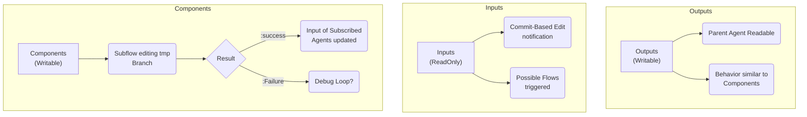

# Mentci-AI Filesystem Specification (Aski-FS)

**Status:** Operational / Canonical
**Objective:** Define the semantic lifecycle of artifacts across the Mentci-AI hierarchy.

## 1. Global Ontology



## 2. Directory Semantics

### 2.1 Inputs (`Inputs/`)
- **Mode:** Read-Only (Mount points to Nix Store or immutable snapshots).
- **Behavior:** Acts as the "Sensory Input" for the agent.
- **Ontology:** The inputs represent a hierarchical mapping of the project's semantic dependencies (Atom, Flake, and Untyped sources).
- **Propagation:** Changes in inputs (via `jj git fetch` or snapshot updates) trigger **Commit-Based Edit Notifications**, which can initiate new agentic flows.

### 2.2 Outputs (`Outputs/`)
- **Mode:** Writable (Scoped to the current session).
- **Behavior:** Intended for consumption by the Parent Agent or external supervisors.
- **Lifecycle:** Once validated, outputs are often promoted to the `Inputs/` of another agent or merged into the primary repository.

### 2.3 Components (`core/`, `src/`, `scripts/`)
- **Mode:** Writable (via Subflows).
- **Behavior:** Subflows edit a **Temporary Branch** (anonymous `jj` revision).
- **Promotion:**
    - **:success** -> The change is committed and becomes the new input for subscribed agents.
    - **:failure** -> Initiates a **Debug Loop** (Ref: `strategies/debugging/`).

## 3. Symbolic Mapping (Aski-FS)
The following EDN structure (Ref: `inputs.aski-fs`) defines the authoritative symbolic map of the `inputs` directory:

```clojure
{:root
 {:path "inputs"
  :kind :dir
  :role :tooling
  :children
  {"mentci-ai" {:kind :dir :inputType :atom}
   "criomos" {:kind :dir :inputType :flake}
   "lojix" {:kind :dir :inputType :flake}
   "seahawk" {:kind :dir :inputType :flake}
   "skrips" {:kind :dir :inputType :flake}
   "mkZolaWebsite" {:kind :dir :inputType :flake}
   "webpublish" {:kind :dir :inputType :flake}
   "goldragon" {:kind :dir :inputType :flake}
   "maisiliym" {:kind :dir :inputType :flake}
   "kibord" {:kind :dir :inputType :flake}
   "aski" {:kind :dir :inputType :flake}
   "attractor" {:kind :dir :inputType :untyped}
   "attractor-docs" {:kind :dir :inputType :untyped}
   "opencode" {:kind :dir :inputType :untyped}}}}
```

## 4. Implementation Rules
- Agents **must** respect the `RO` (Read-Only) status of `Inputs/`.
- Every writable operation **must** result in an atomic `jj` commit.
- Filesystem boundaries (directories) represent **Ontological Shifts** in data durability.

*The Great Work continues.*
