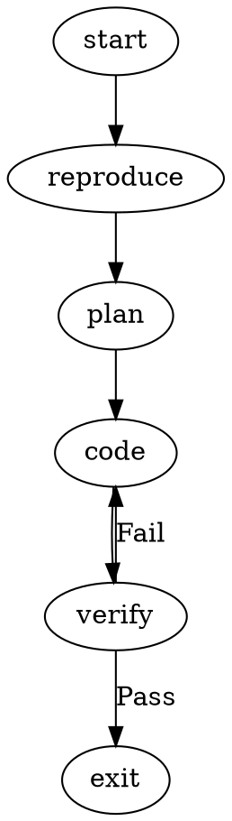

# High-Level Operation of Brynary-Attractor

**Date:** Feb 20, 2026
**Status:** In Practice (Draft)

Brynary-Attractor is an **orchestration standard for autonomous agents**. Unlike chat-based agents (which loop until they decide to stop) or simple state machines (which are rigid), Attractor treats **workflows as graphs** and **execution as a compilation process**. Mentci-AI incorporates this standard; it does not implement Attractor.

It separates the **definition of work** (the Graph) from the **doing of work** (the Handlers), allowing for crash-proof, inspectable, and steerable agent behaviors.

---

## 1. The Core Philosophy
*   **The Graph is the Code:** Agents don't just "act"; they traverse a pre-defined map (DAG) of cognitive steps.
*   **State is Durable:** Every step produces a checkpoint. If the process crashes or is stopped, it can resume from the last successful node without re-doing work.
*   **Tooling is Native:** Agents use the specific tool formats they were trained on (e.g., `apply_patch` for OpenAI, `edit_file` for Anthropic) rather than a generic abstraction layer.

---

## 2. How It Operates (The Lifecycle)

### Step 1: Definition (The `.dot` file)
A developer defines the workflow in Graphviz DOT syntax. This file declares the steps (Nodes) and the logic for moving between them (Edges).

### Step 2: Initialization
The Engine parses the DOT file and creates a **Run Directory** (`.mentci/runs/<id>/`).
*   It loads the initial **Context** (files, git status, user intent).
*   It applies **Transforms** (e.g., expanding `$goal` variables in prompts).

### Step 3: The Execution Loop (Traversal)
The Engine moves through the graph one node at a time.

1.  **Resolve Node:** The engine looks at the current node's type (e.g., `codergen`, `wait.human`).
2.  **Dispatch Handler:** The appropriate Handler (Rust code) is invoked.
    *   *Cognition (LLM):* The handler compiles the prompt, calls the LLM, executes tools (Simulated or Real), and returns an outcome.
    *   *Human Gate:* The handler pauses and waits for user input via CLI/API.
    *   *Logic:* The handler evaluates a condition (e.g., "Did the tests pass?").
3.  **Checkpoint:** The engine saves the entire state (Context + Outcome) to `checkpoint.json`.
4.  **Route:** The engine evaluates the edges from the current node.
    *   If `condition="outcome=success"` matches, it follows that edge.
    *   If `condition="outcome=fail"`, it follows the failure path (e.g., back to `plan`).

### Step 4: The Agentic Loop (Inner Loop)
Inside a "Cognition" node (e.g., `codergen`), a mini-loop runs:
1.  **Observe:** Read file context, git status, and previous errors.
2.  **Act:** The LLM issues tool calls (e.g., `read_file`, `shell`, `apply_patch`).
3.  **Reflect:** The handler captures stdout/stderr, truncates it if too large, and feeds it back to the LLM.
4.  **Steer:** The user can inject "Steering Messages" mid-loop to correct the agent without restarting the node.

---

## 3. Key Differentiators in Practice

| Feature | Standard Agent | Brynary-Attractor |
| :--- | :--- | :--- |
| **Control Flow** | "Loop until happy" (Opaque) | **Explicit Graph** (Inspectable) |
| **Context** | Single growing history | **Fidelity Management** (Summary vs. Full) |
| **Resilience** | Lost on crash | **Checkpoint & Resume** |
| **Tools** | Generic "fs.writeFile" | **Native** (`apply_patch` vs `edit_file`) |
| **Human Role** | "Chat user" | **First-class Gate** (Approver/Steerer) |

## 4. Summary
In practice, using Brynary-Attractor feels like **debugging a process** rather than **arguing with a chatbot**. You define the standard operating procedure (SOP) for a task once, and the agent follows that SOP every time, with the ability for you to intervene (Steer) or approve (Gate) at critical junctures.
